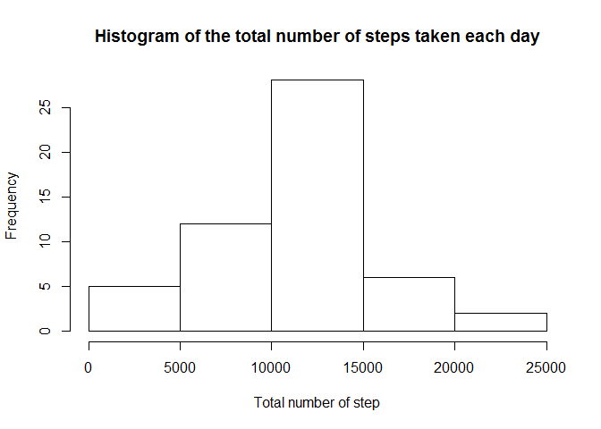

# Reproducible Research: Peer Assessment 1


## Loading and preprocessing the data

```r
dtable = read.csv("activity/activity.csv")
summary(dtable)
```

```
##      steps                date          interval     
##  Min.   :  0.00   2012-10-01:  288   Min.   :   0.0  
##  1st Qu.:  0.00   2012-10-02:  288   1st Qu.: 588.8  
##  Median :  0.00   2012-10-03:  288   Median :1177.5  
##  Mean   : 37.38   2012-10-04:  288   Mean   :1177.5  
##  3rd Qu.: 12.00   2012-10-05:  288   3rd Qu.:1766.2  
##  Max.   :806.00   2012-10-06:  288   Max.   :2355.0  
##  NA's   :2304     (Other)   :15840
```


## What is mean total number of steps taken per day?
The total number of steps taken per day:

```r
dtable$date = as.character(dtable$date)
new_data = na.omit(dtable)
sum_day = tapply(new_data$steps, new_data$date, sum)
```

Histogram of the total number of steps taken each day:

```r
hist(sum_day, xlab = "Total number of step", main = "Histogram of the total number of steps taken each day")
```

 

```r
mean_steps = mean(sum_day)
median_steps = median(sum_day)
```

The mean and median of the total number of steps taken per day are 1.0766189\times 10^{4} and 10765 respectively.


## What is the average daily activity pattern?
Plot of the 5-minute interval (x-axis) and the average number of steps taken, averaged across all days (y-axis)


```r
mean_interval = tapply(new_data$steps, new_data$interval, mean)
plot(names(mean_interval), mean_interval, type = "l", xlab = "Interval", ylab = "Number of steps")
```

 

```r
index = which.max(mean_interval)
max_interval = names(index)
```
The 5-minute interval which contains the maximum number of steps is 835.

## Imputing missing values


```r
nb_missing_values = sum(is.na(dtable))
```
The total number of missing values in the dataset is 2304.

Filling the missing values in the dataset.
Fist, the mean of each interval is already computed in mean_interval variable.


```r
nb_intervals = length(mean_interval)
na_indices = which(is.na(dtable$steps))
new_dtable = dtable
new_dtable[na_indices, 1] = mean_interval[(((na_indices - 1)%% nb_intervals) + 1)]
```

Make a histogram of the total number of steps taken each day and Calculate and report the mean and median total number of steps taken per day. 


```r
new_dtable$date = as.character(new_dtable$date)
new_sum_day = tapply(new_dtable$steps, new_dtable$date, sum)
```

Histogram of the total number of steps taken each day:

```r
hist(new_sum_day, xlab = "Total number of step", main = "Histogram of the total number of steps taken each day")
```

 

```r
new_mean_steps = mean(new_sum_day)
new_median_steps = median(new_sum_day)
```

The mean and median of the total number of steps taken per day (using filling dataset) are 1.0766189\times 10^{4} and 1.0766189\times 10^{4} respectively.

Do these values differ from the estimates from the first part of the assignment? What is the impact of imputing missing data on the estimates of the total daily number of steps? Yes, slightly different, we observe that the middle bar is longer, because we fill the missing values with the average, and the new days fall in the middle.

## Are there differences in activity patterns between weekdays and weekends?
Create a new factor variable (day_week) in the dataset with two levels - "weekday" and "weekend" indicating whether a given date is a weekday or weekend day.


```r
new_dtable$date = as.Date(new_dtable$date, "%Y-%m-%d")
week_days = weekdays(new_dtable$date )
new_dtable$day_week = factor((week_days %in% c("Sunday", "Saturday")), labels = c("weekday", "weekend"))
```

Make a panel plot containing a time series plot (i.e. type = "l") of the 5-minute interval (x-axis) and the average number of steps taken, averaged across all weekday days or weekend days (y-axis).


```r
library(lattice)
xyplot(steps ~ interval| day_week, data = new_dtable, layout = c(1, 2), panel = function(x, y, ...){panel.average(x, y, col='blue', lwd=1, horizontal=F)}, ylim = c(0, 250))
```

 


